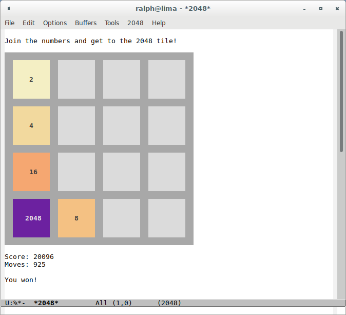

# Emacs 2048

Play Gabriele Cirulli's 2048 puzzle game in an Emacs buffer.

Notable features:

* Coloured board and tiles.
* User-defined undo list length; default is five moves.
* User-defined board size; default is four rows and columns.

Have fun!

## Installation

Copy file ‘rs-2048.el’ into a directory in your Emacs load path.
Optionally byte-compile ‘rs-2048.el’.  Then add the following code
to your Emacs initialization file:

     (autoload 'play-2048 "rs-2048" "Play 2048." t)
     (autoload '2048-game "rs-2048" "Play 2048." t)

Now you can say ‘M-x play-2048’ or ‘M-x 2048-game’.
